# note2

### Tracking
tracking线程整体流程图

Tracking线程函数主要功能和流程
TrackWithMotionModel
按照运动模式来进行Track，按照上一帧的速度与位姿作为初始，进行投影优化

    1. 先通过上一帧的位姿和速度预测当前帧相机的位姿
    2. 通过PnP方法估计相机位姿，在将上一帧的地图点投影到当前固定大小范围的帧平面上，如果匹配点少，那么扩大两倍的采点范围。
    3. 然后进行一次BA算法，通过最小二乘法优化相机的位姿。
    4. 优化位姿之后，对当前帧的关键点和地图点，抛弃无用的杂点，剩下的点供下一次操作使用。

TrackReferenceKeyFrame

按照关键帧来进行Track，从关键帧中查找Bow相近的帧，进行匹配优化位姿

    1. 按照关键帧进行Track的方法和运动模式恢复相机运动位姿的方法接近。首先求解当前帧的BOW向量。
    2. 再搜索当前帧和关键帧之间的关键点匹配关系，如果这个匹配关系小于15对的话，就Track失败了。
    3. 接着讲当前帧的位置假定到上一帧的位置那里
    4. 并通过最小二乘法优化相机的位姿。
    5. 最后依然是抛弃无用的杂点，当match数大于等于10的时候，返回true成功。

Relocalization

重定位，从之前的关键帧中找出与当前帧之间拥有充足匹配点的候选帧，利用Ransac迭代，通过PnP求解位姿。

    1. 先计算当前帧的BOW值，并从关键帧数据库中查找候选的匹配关键帧
    2. 构建PnP求解器，标记杂点，准备好每个关键帧和当前帧的匹配点集
    3. 用PnP算法求解位姿，进行若干次P4P Ransac迭代，并使用非线性最小二乘优化，直到发现一个有充足inliers支持的相机位置。
    4. 返回成功或失败

MonocularInitialization

单目相机的初始化过程，通过将最初的两帧之间进行对极约束和全局BA优化，得到较为准确的初始值

    1. 当第一次进入该方法的时候，没有先前的帧数据，将当前帧保存为初始帧和最后一帧，并初始化一个初始化器。
    2. 第二次进入该方法的时候，已经有初始化器了。
    3. 利用ORB匹配器，对当前帧和初始帧进行匹配，对应关系小于100个时失败。
    4. 利用八点法的对极约束，启动两个线程分别计算单应矩阵和基础矩阵，并通过score判断用单应矩阵回复运动轨迹还是使用基础矩阵回复运动轨迹。
    5. 将初始帧和当前帧创建为关键帧，并创建地图点MapPoint
    6. 通过全局BundleAdjustment优化相机位姿和关键点坐标
    7. 设置单位深度并缩放初试基线和地图点。
    8. 其他变量的初始化。

TrackLocalMap

通过投影，从已经生成的地图点中找到更多的对应关系，精确结果
    1. 更新Covisibility Graph， 更新局部关键帧
    2. 根据局部关键帧，更新局部地图点，接下来运行过滤函数  isInFrustum
    3. 将地图点投影到当前帧上，超出图像范围的舍弃
    4. 当前视线方向v和地图点云平均视线方向n, 舍弃n*v<cos(60)的点云
    5. 舍弃地图点到相机中心距离不在一定阈值内的点
    6. 计算图像的尺度因子 isInFrustum 函数结束
    7. 进行非线性最小二乘优化
    8. 更新地图点的统计量

NeedNewKeyFrame

判断是否需要生成新的关键帧，确定关键帧的标准

    1. 在上一次进行重定位之后，过了20帧数据，或关键帧数小于20个，不满足不能生成
    2. 在上一个关键帧插入之后，过了20帧，或 局部建图是空闲状态，不满足不能生成。
    3. 当前帧跟踪到大于若干个点，不满足不能生成
    4. 当前帧的跟踪点数小于90%的参考关键帧跟踪点数，并且当前帧跟踪点数大于15，不满足不能生成

CreateNewKeyFrame
生成新的关键帧

### Local Mapping
#### LocalMapping线程介绍
ORBSlam2中的视觉里程计VO不仅仅包含Tracking线程，LocalMapping也是VO中的一部分。Tracking线程负责对图像进行预处理并提取特征还原真实3维场景下的点特征，并提取关键帧交给LocalMapping线程。

而LocalMapping线程主要的工作就是通过不断的加入新KeyFrame和新地图点，剔除冗余KeyFrame和冗余地图点，来维护一个稳定的KeyFrame集合，从而可以进行后面的LoopClosing操作

LocalMapping线程主要流程
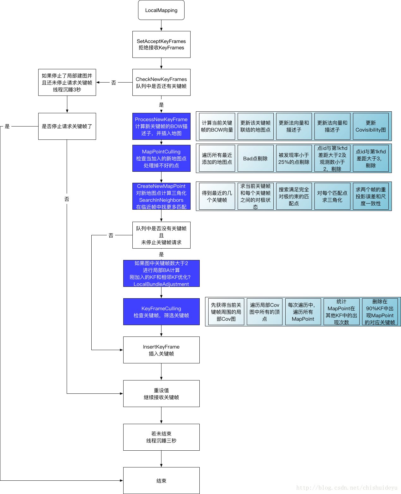

主要的几个功能点在

* 计算新关键帧的描述子并插入地图
* 地图点的筛选
* 新地图点的三角化和再优化
* 局部BA优化
* 关键帧的筛选

#### 计算新关键帧的描述子并插入地图

我们先计算当前关键帧的BoW向量

    // 计算当前关键帧的BOW向量
    mpCurrentKeyFrame->ComputeBoW();

然后更新当前关键帧所看到的地图点的观测值

    const vector<MapPoint*> vpMapPointMatches = mpCurrentKeyFrame->GetMapPointMatches();

    for(size_t i=0; i<vpMapPointMatches.size(); i++)
    {
        MapPoint* pMP = vpMapPointMatches[i];
        if(pMP)
        {
            if(!pMP->isBad())
            {
                if(!pMP->IsInKeyFrame(mpCurrentKeyFrame))
                {
                    pMP->AddObservation(mpCurrentKeyFrame, i);
                    pMP->UpdateNormalAndDepth(); //更新法线和深度
                    pMP->ComputeDistinctiveDescriptors();// 更新描述子
                }
                else // this can only happen for new stereo points inserted by the Tracking
                {
                    mlpRecentAddedMapPoints.push_back(pMP);
                }
            }
        }
    }

接着更新Covisibility图的边，并将该关键帧插入到地图中

    // 更新Covisibility图中的边
    mpCurrentKeyFrame->UpdateConnections();

    // 将关键帧插入到地图中
    mpMap->AddKeyFrame(mpCurrentKeyFrame);

#### 地图点的筛选
在这一步需要检查最近加入的这些地图点，并将一些冗余的地图点从最近地图点的列表中去除 
有四处地图点的剔除规则

    //如果地图点是被标记为bad的时候
    if(pMP->isBad())
    {
        lit = mlpRecentAddedMapPoints.erase(lit);

    //有超过25%的关键帧可以看到这个点
    else if(pMP->GetFoundRatio()<0.25f )
    {
        pMP->SetBadFlag();
        lit = mlpRecentAddedMapPoints.erase(lit);
    }
    //未被超过2个关键帧看到，并且当前关键帧的ID和看到该点的第一个关键帧之间的ID之差大于等于2的时候
    else if(((int)nCurrentKFid-(int)pMP->mnFirstKFid)>=2 && pMP->Observations()<=cnThObs)
    {
        pMP->SetBadFlag();
        lit = mlpRecentAddedMapPoints.erase(lit);
    }

    //当前关键帧的ID和看到该点的第一个关键帧之间的ID之差大于等于3的时候
    else if(((int)nCurrentKFid-(int)pMP->mnFirstKFid)>=3)
        lit = mlpRecentAddedMapPoints.erase(lit);

#### 新地图点的三角化和再优化
在这一步中，重新当前关键帧附近的关键帧与当前关键帧之间的对极约束，通过该对极约束还原当前关键帧到附近关键帧的变换，并通过这种变换进行三角化计算

* 获取Cov图中附近的关键帧，这里的nn代表最多取多少个关键帧
---

    int nn = 10;
    if (mbMonocular)
        nn = 20;
    const vector<KeyFrame *> vpNeighKFs = mpCurrentKeyFrame->GetBestCovisibilityKeyFrames(nn);

* 计算当前帧和每个附近关键帧之间的对极约束，计算满足对极约束的匹配点 这段代码求解两个关键帧之间的对极约束的情况，这段代码之上求解的是基线等对极约束的所需参数，这段代码之下求解的是对极约束得到的R和t
---

    if (!mbMonocular)
    {
        if (baseline < pKF2->mb)
            continue;
    }
    else
    {
        const float medianDepthKF2 = pKF2->ComputeSceneMedianDepth(2);
        const float ratioBaselineDepth = baseline / medianDepthKF2;
        if (ratioBaselineDepth < 0.01)
            continue;
    }
    // 计算基础矩阵
    cv::Mat F12 = ComputeF12(mpCurrentKeyFrame, pKF2);
    // 搜索满足完全对极约束的匹配点
    vector<pair<size_t, size_t>> vMatchedIndices;
    matcher.SearchForTriangulation(mpCurrentKeyFrame, pKF2, F12, vMatchedIndices, false);

---
* 对当前帧和某一个关键帧之间的匹配点进行三角化计算，求解匹配点的深度。
* 接着分别检查新得到的点在两个平面上的重投影误差，如果大于一定的值，直接抛弃该点。
* 检查尺度一致性

#### 局部BA优化

ORBSlam2中使用了对极约束，三角测量，PnP投影和BundleAdjustment算法 
本文着重讲解在ORBSlam2中使用到的BundleAdjustment优化算法。

1 全局BundleAdjustment算法
在ORBSlam2的Tracking线程中，进行相机状态初始化的时候，当使用对极约束时，求解了第一帧和第二帧之间的单应矩阵和基本矩阵，并通过三角测量得到两帧匹配点的三维位置之后，使用了全局BA算法进行了一次细致的位姿优化。 
这一过程比较单调，就是普通的BundleAdjustment优化过程 
先设定帧顶点，再设置MapPoint顶点，然后添加边信息。 
执行BA迭代优化再替换原本的数据。

2 局部BundleAdjustment算法
在ORBSlam2的LocalMapping线程中，在进行局部建图的时候，需要进行一次局部BundleAdjustment优化。

局部BA优化的过程是，通过当前取得的关键帧找到附近的局部关键帧，局部地图点和可以观察到这些局部地图点但是不是局部关键帧的关键帧作为固定关键帧。

我们通过固定附近的fixFK，统一优化附近的局部关键帧和当前关键帧的位姿，如果局部关键帧为空，那么不调整局部关键帧。

1 构造局部关键帧列表 
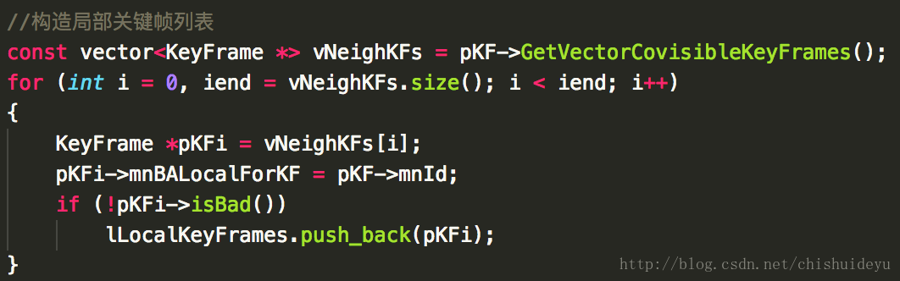
2 构造在局部关键帧中看到的局部地图点列表 
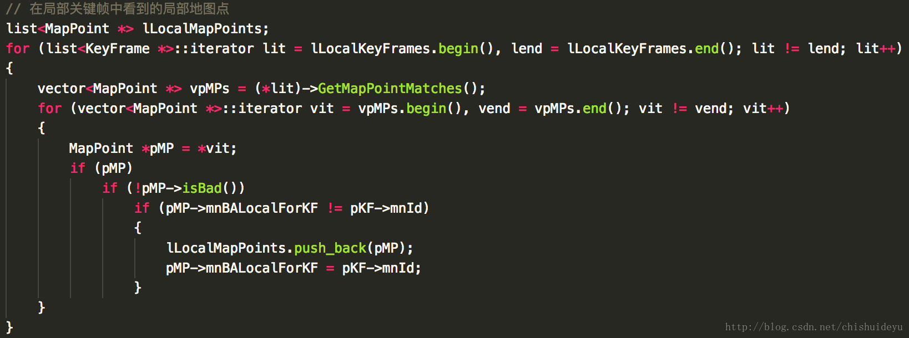

3 构造固定关键帧列表。可以查看到局部MapPoint，但不是局部关键帧的关键帧是固定关键帧。 

4 设置顶点
5 进行优化，这里的优化过程不同于上面的全局BA优化。 
首先进行5次迭代优化 
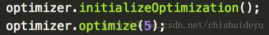
 
然后检查优化正确点的观测值，将异常点排除在外，继续进行一次10次迭代优化 
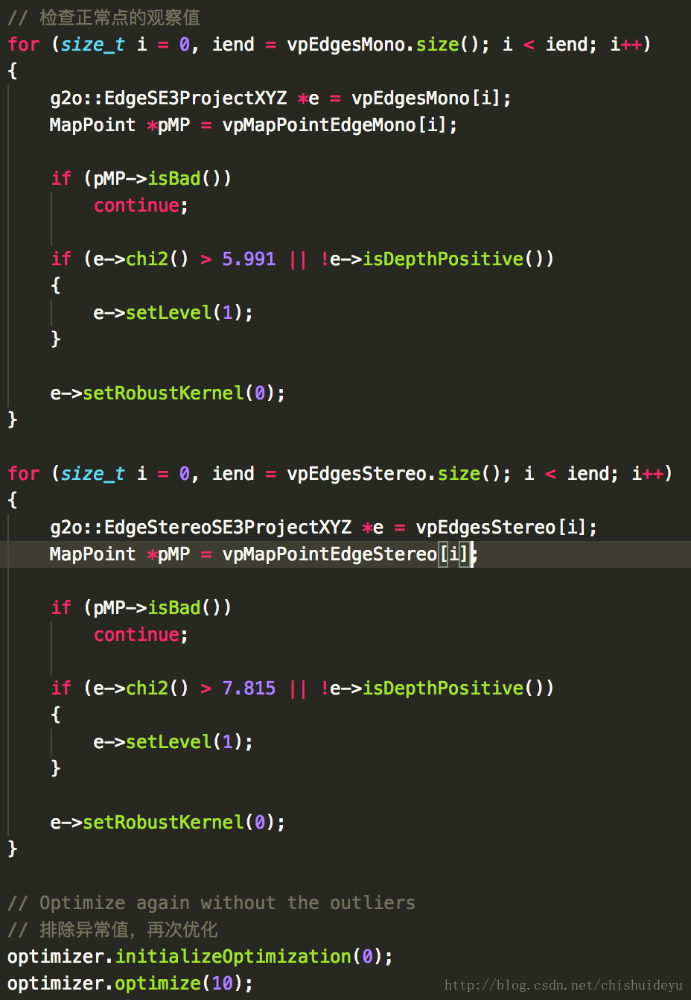

3. 位姿调整函数PoseOptimization
在Tracking线程中，每一次进行位姿优化的时候，每进行过一次PnP投影操作将地图点投影到当前平面上之后，都会进行一次PoseOptimization位姿优化，通过BA优化重投影误差。

1 在这里个方法中，先是利用g2o的设置了每个帧顶点 
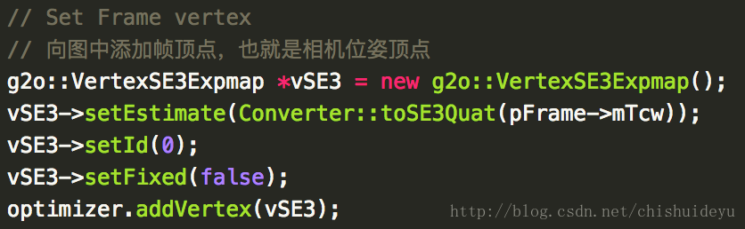

2 再将每个地图点作为顶点保存起来作为优化的参数，要注意的是，这里信息矩阵不是单位矩阵，而是单位矩阵和关键点所在高斯模糊金字塔的层数的乘积，并且为了防止错误的关键点扰乱其他关键点的优化，从而使用了Huber核函数来使鲁棒性更强 

3 再使用四次最小二乘的优化 
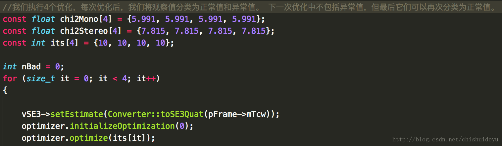

4 最后再将原本的位姿替换为优化后的位姿，并返回正常值的数量。 
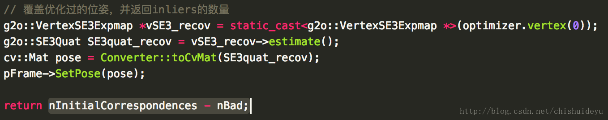

#### 关键帧的筛选
关键帧的筛选的规则，在代码中已经给出了

    检查冗余关键帧（仅限局部关键帧） 
    如果它看到的90％的MapPoints至少在其他3个关键帧（同样或更精细的尺度）中被看到，则关键帧被认为是冗余的

这里直接把代码贴出来

    vector<KeyFrame *> vpLocalKeyFrames = mpCurrentKeyFrame->GetVectorCovisibleKeyFrames();
    //获取附近的局部关键帧的vector变量
    for (vector<KeyFrame *>::iterator vit = vpLocalKeyFrames.begin(), vend = vpLocalKeyFrames.end(); vit != vend; vit++)
    {
        //每个关键帧都遍历一遍
        KeyFrame *pKF = *vit;
        if (pKF->mnId == 0)
            continue;
        const vector<MapPoint *> vpMapPoints = pKF->GetMapPointMatches();//获取局部关键帧中的匹配地图点

        int nObs = 3;
        const int thObs = nObs;
        int nRedundantObservations = 0;
        int nMPs = 0;
        for (size_t i = 0, iend = vpMapPoints.size(); i < iend; i++)
        {
            //每个匹配地图点都遍历一遍
            MapPoint *pMP = vpMapPoints[i];
            if (pMP)
            {
                if (!pMP->isBad())
                {
                    if (!mbMonocular)
                    {
                        if (pKF->mvDepth[i] > pKF->mThDepth || pKF->mvDepth[i] < 0)
                            continue;
                    }
                    nMPs++;
                    if (pMP->Observations() > thObs)
                    {
                        const int &scaleLevel = pKF->mvKeysUn[i].octave;//当前关键点所处层级
                        const map<KeyFrame *, size_t> observations = pMP->GetObservations();//当前地图点被观察数
                        int nObs = 0;
                        for (map<KeyFrame *, size_t>::const_iterator mit = observations.begin(), mend = observations.end(); mit != mend; mit++)
                        {
                            KeyFrame *pKFi = mit->first;
                            if (pKFi == pKF)
                            continue;
                            const int &scaleLeveli = pKFi->mvKeysUn[mit->second].octave;
                            if (scaleLeveli <= scaleLevel + 1)
                            {
                                nObs++;
                                if (nObs >= thObs)//被观察数达到3
                                    break;
                            }
                        }
                        if (nObs >= thObs)
                        {
                            nRedundantObservations++;//冗余观察数累加
                        }
                    }
                }
            }
        }
        if (nRedundantObservations > 0.9 * nMPs)
            pKF->SetBadFlag();
    }

### LoopClosing
LoopClosing在现在的Slam系统中是非常重要的一个部分，VO总是会有累计误差，而LoopClosing通过检测是否曾经来过此处，进行后端优化，可以将这个累计误差缩小到一个可接受的范围内。从而使得Slam系统应对大范围场景时，拥有更高的鲁棒性和可用性。
> ORBSlam2中的LoopClosing闭环检测线程主要进行闭环检测，并在检测到闭环的时候计算Sim3变换，进行后端优化。

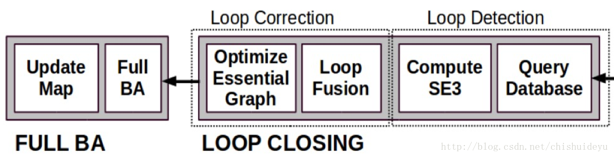

#### 检测闭环 DetectLoop
首先我们会检测当前关键帧在Covisibility图中的附近关键帧，并会依次计算当前关键帧和每一个附近关键帧的BoW分值，通过我们所得到分数的最低分，到数据库中查询，查找出所有大于该最低分的关键帧作为候选帧，用以检测闭环。

1 如果地图中的关键帧数小于10，那么不进行闭环检测
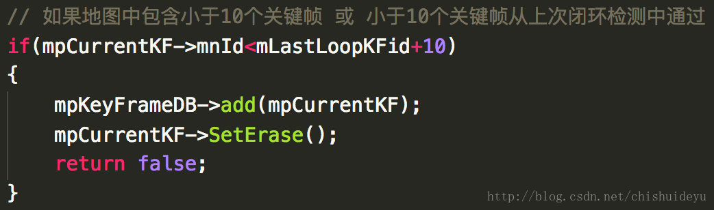

2 获取共视关键帧，并计算他们和当前关键帧之间的BoW分数，求得最低分
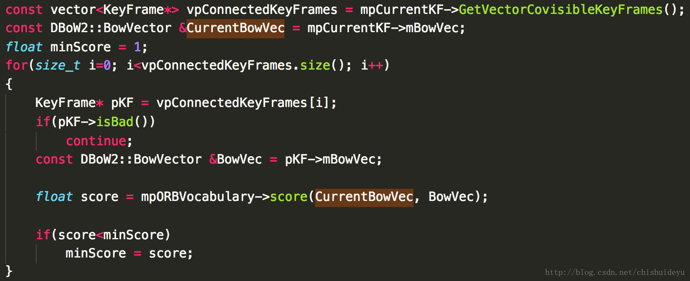

3 通过上一步计算出的最低分数到数据库中查找出候选关键帧，这一步相当于是找到了曾经到过此处的关键帧们
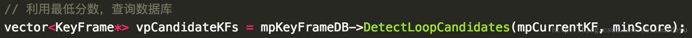
这一步是非常重要的，相当于是在为闭环检测做前期的预处理

3.1 首先，得到与当前帧的链接的关键帧。 

    set<KeyFrame*> spConnectedKeyFrames = pKF->GetConnectedKeyFrames();

3.2 然后，在地图中搜索与当前关键帧共享一个BOW word的关键帧，并排除上一步搜集到的附近关键帧，得到候选帧，这些候选帧基本上都是曾经来到此处看到的。 
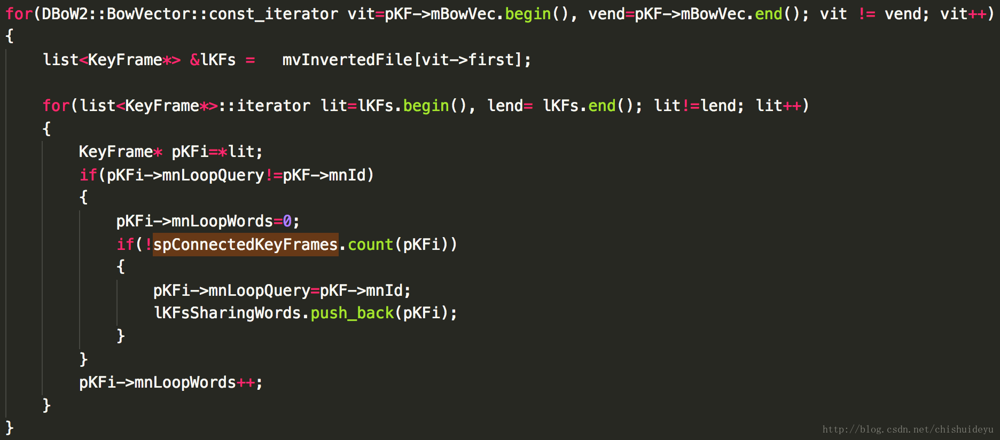

3.3 统计这些帧中，与当前关键帧的Bow共有Word最多的单词数maxCommonWords。
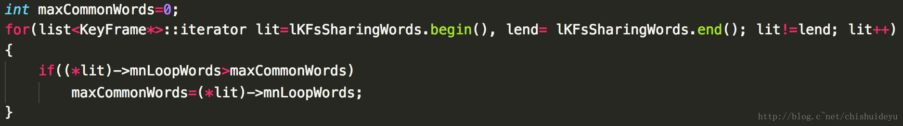 

3.4 计算最低共有单词数阈值minCommonWords = maxCommonWords*0.8f，并搜寻候选帧中，共有单词数大于minCommonWords的关键帧，并计算它与当前帧的score分值。
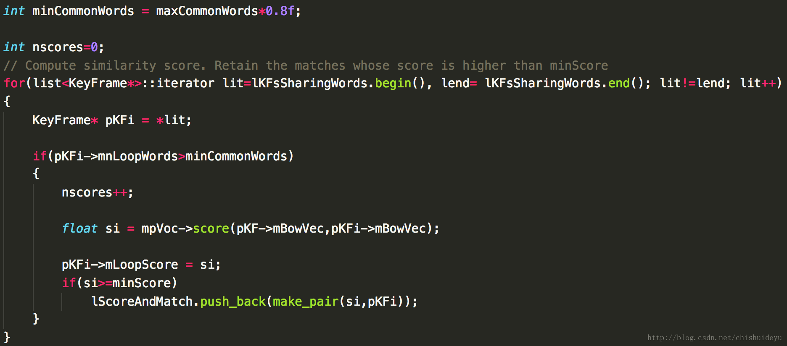 

3.5 将这些候选帧进行聚类，相连的候选帧聚为同一类，并计算每一组的累计得分，得到最高累计分的组，并得分数最高组的最高分的关键帧。 
这样的话，会把一些拥有很高分数的独立出来的关键帧给去掉，因为他并没有跟其他关键帧相连，没有连续性，所以这一步就是去除这些得分很高的错误关键帧。 
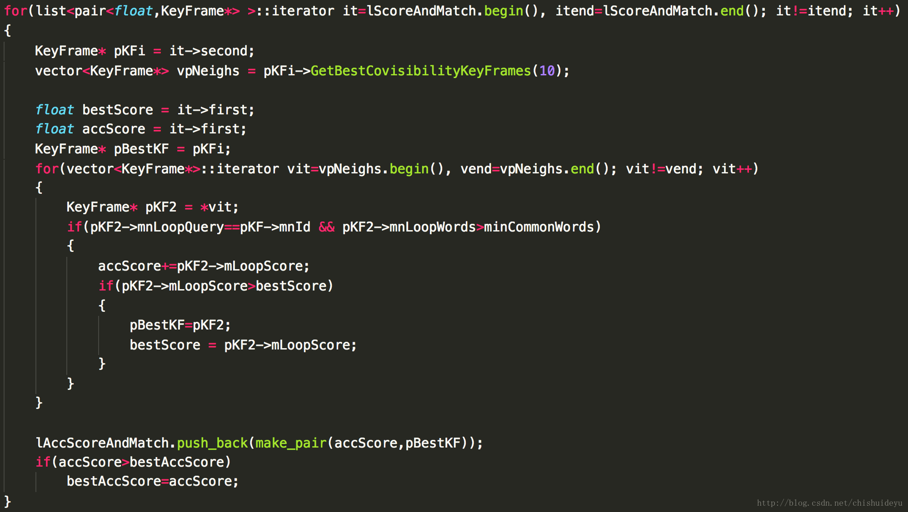

3.6 得到最后一个阈值 minScoreToRetain = 0.75f*bestAccScore，再通过这个最低阈值，计算出这些候选帧中比这个分值高的关键帧，并保存起来返回。 
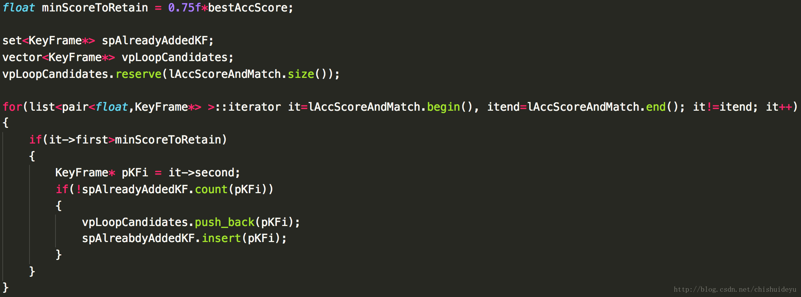

4 对候选关键帧集进行连续性检测(有的文章也翻译为一致性检测)
这一步相当于是检测上一步得到的关键帧集是否是真的可以使用的。 
（由于这段网络上很少有介绍，所以这部分我是按照我自己的理解写的，如果有错误，希望有人能够指出） 

闭环连续性是什么
每次我们在上一步的数据库查询操作里找到了候选关键帧之后，基本上找到的候选关键帧就是我们所要找的闭环关键帧，但是为了防止错误进行闭环检测，我们非常有必要再进行一次连续性检测，连续性检测的意思就是，是否我们在三个当前的关键帧内都同时发现了某一个闭环候选帧的话，那么就表明当前的SLAM系统已经闭环。

详细解释
比方说，在上图中，通过数据库查询，我们可以在A点得到闭环候选关键帧有两个(1,2)。在下一次进入DetectLoop函数的时候，我们当前拿到的关键帧是B，那么在B点我们可以得到的闭环候选关键帧是(1,2,3)，以此类推，在再下一次进入DetectLoop函数的时候，也就是在C点的时候，我们这时对比到的闭环候选关键帧是(2,3)，所以2这个闭环候选关键帧被检测到了三次。在LoopClosing中，mnCovisibilityConsistencyTh = 3 一致性共视阈值被设为3，并且如果一旦有一个闭环候选关键帧被检测到3次，系统就认为检测到闭环。

在每一次进行完闭环候选连续性检测之后，该线程都会保存在这一关键帧下的计数情况，保存的变量也就是mvConsistentGroups，以供给下一轮循环使用。

#### 计算Sim3 ComputeSim3
既然上一步我们已经检测到了闭环，那么我们现在就需要开始进行后端优化了。该函数主要工作就是在当前关键帧和闭环帧之间找到更多的对应点，并通过这些对应点计算当前关键帧和闭环帧之间的Sim3变换，求解出Rt和s。在这一过程中，共进行了三次对应点的查找工作。

1 对每一个闭环帧，通过BoW的matcher方法进行第一次匹配，匹配闭环帧和当前关键帧之间的匹配关系，如果对应关系少于20个，则丢弃，否则构造一个Sim3求解器并保存起来。这一步主要是对效果较好的闭环帧构建Sim3求解器 
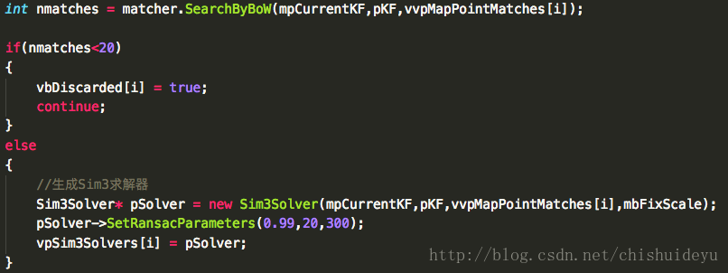

2 对上一步得到的每一个满足条件的闭环帧，通过RANSAC迭代，求解Sim3。 
对于这里的Sim3的Ransac迭代，我在网上也没有找到很多的解释，我们都知道Ransac是根据一组包含异常数据的样本数据集，计算出数据的数学模型参数的方法，在这里使用Ransac的方法，可以大大提高对杂点干扰的鲁棒性。 
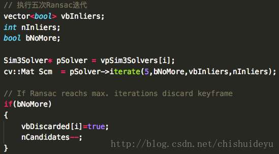

3 通过返回的Sim3进行第二次匹配。 
刚才得到了Sim3，所以现在要利用Sim3再去进行匹配点的查找，本次查找的匹配点数量，会在原来的基础上有所增加。
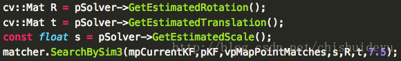 

4 使用非线性最小二乘法优化Sim3. 
在拿到了第二次匹配的结果以后，要通过这些匹配点，再去优化Sim3的值，从而再精细化Rt和s。 

    const int nInliers = Optimizer::OptimizeSim3(mpCurrentKF, pKF, vpMapPointMatches, gScm, 10, mbFixScale);

5 恢复闭环关键帧和其邻居关键帧的MapPoint地图点 
最后一步求解匹配点的时候，将所指的闭环帧和与其链接的关键帧所看到的所有的MapPoint都恢复出来。通过这个方法，可以尽可能得到我们当前关键帧所能看到的所有的地图点，为下一步做投影匹配，得到更多的匹配点做准备。 
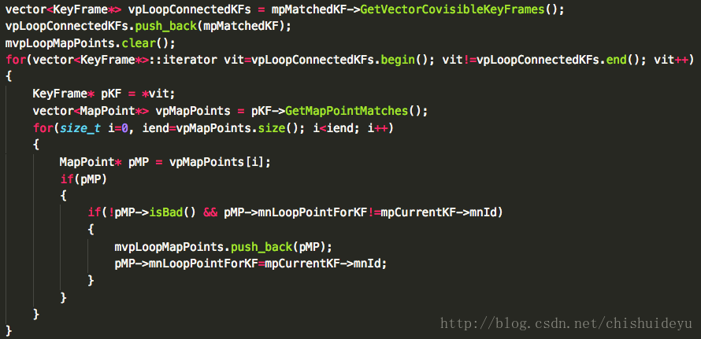

6 使用投影得到更多的匹配点，如果匹配点数量充足，则接受该闭环。 
最后我们通过投影匹配得到了尽可能多的匹配点，通过匹配点的数量判断是否接受闭环。
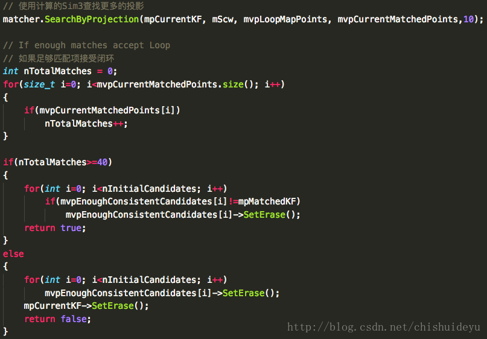 

#### 纠正闭环后端优化 CorrectLoop
在上一步求得了Sim3和对应点之后，就纠正了当前帧的位姿，但是我们的误差不仅仅在当前帧，此前的每一帧都有累计误差需要消除，所以这个函数CorrectLoop就是用来消除这个累计误差，进行整体的调节。

1 如果有全局BA运算在运行的话，终止之前的BA运算。
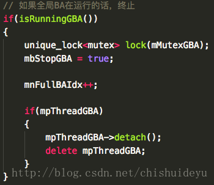 

2 使用传播法计算每一个关键帧正确的Sim3变换值

2.1 得到当前关键帧的附近关键帧的Sim3位姿并用纠正的Sim3位姿与其相乘，保存结果到CorrectedSim3变量中。 
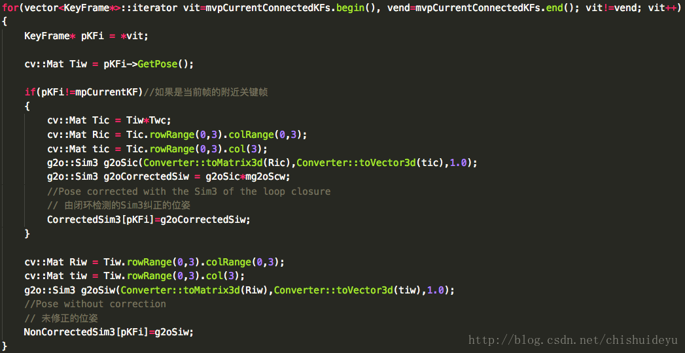

2.2 使用反向投影的方法，将当前关键帧和邻居观察到的地图点得到三维场景下的位姿，并更新关键帧的位姿 
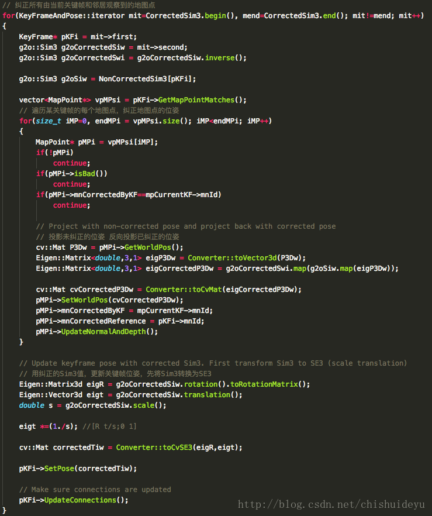

2.3 将当前关键帧的地图点进行融合，其实融合就是判断如果是同一个点的话，那么将当前的地图点强制换成原本的地图点。
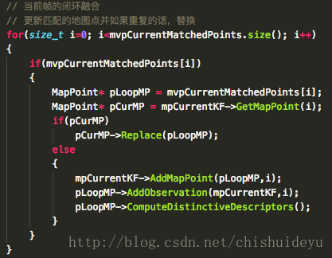 

2.4 使用已纠正的位姿，将在循环关键帧附近观察到的地图点投影到当前的关键帧和邻居，融合重复点。 
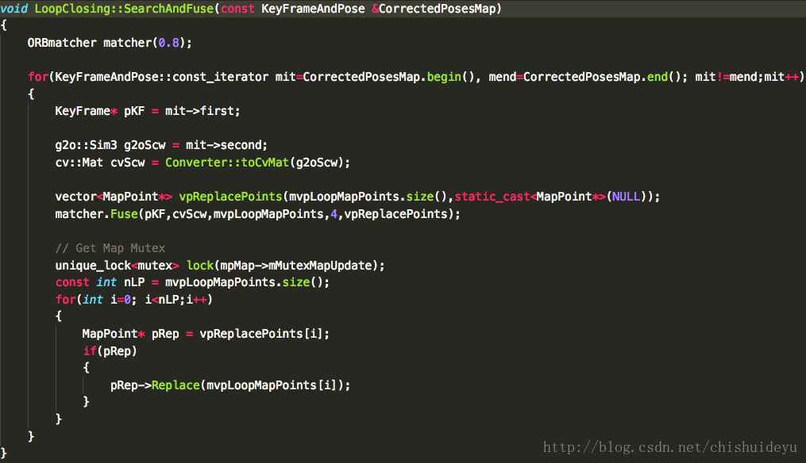

2.5 更新链接，检测新连接 
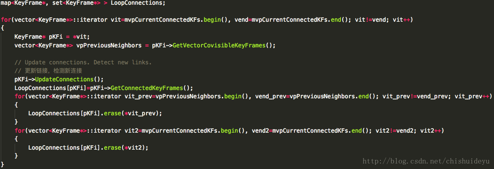

3 优化图 

    Optimizer::OptimizeEssentialGraph(mpMap, mpMatchedKF, mpCurrentKF, NonCorrectedSim3, CorrectedSim3, LoopConnections, mbFixScale); 

使用非线性最小二乘图优化的方法来优化EssentialGraph。

4 全局BA优化 
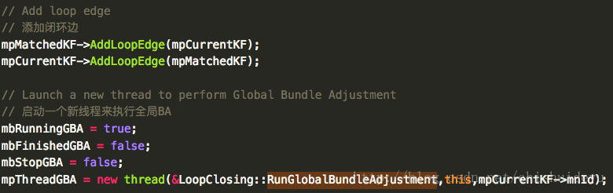

>参考链接 
LoopClosing中的Sim3求解 http://www.cnblogs.com/shang-slam/p/6480863.html 
ORBSlam2闭环检测 http://blog.csdn.net/u010128736/article/details/53409199 
ORBSlam2原文翻译 http://www.sohu.com/a/154011668_715754 
泡泡机器人ORBSlam2解析 http://rosclub.cn/post-505.html

