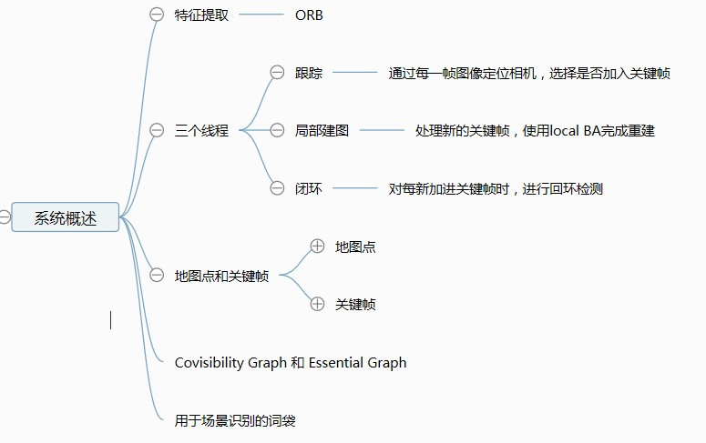
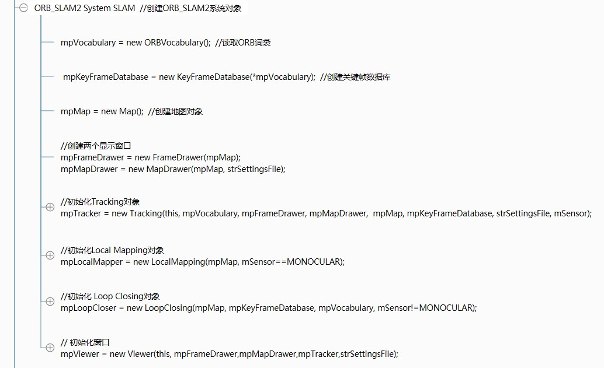
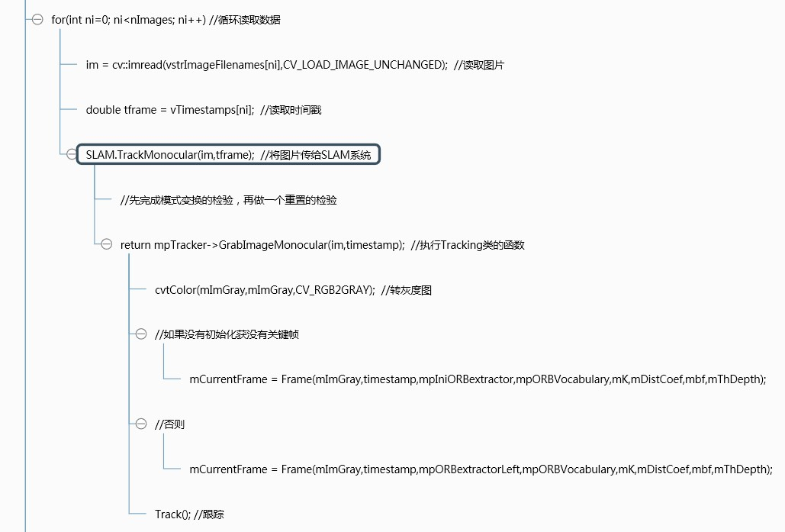
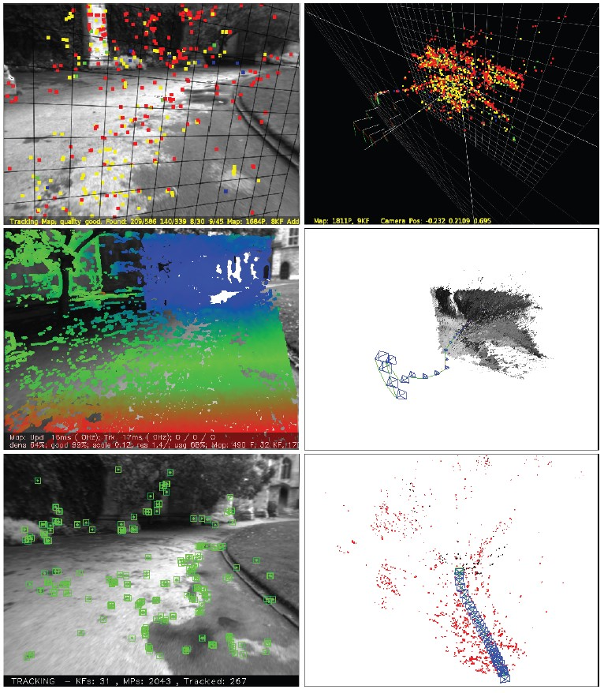
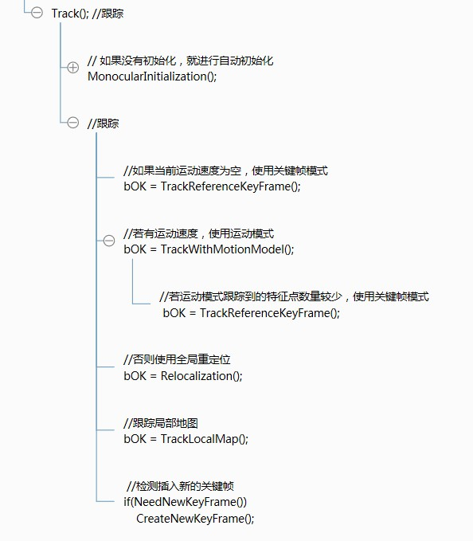
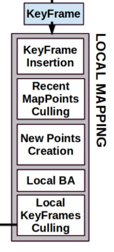
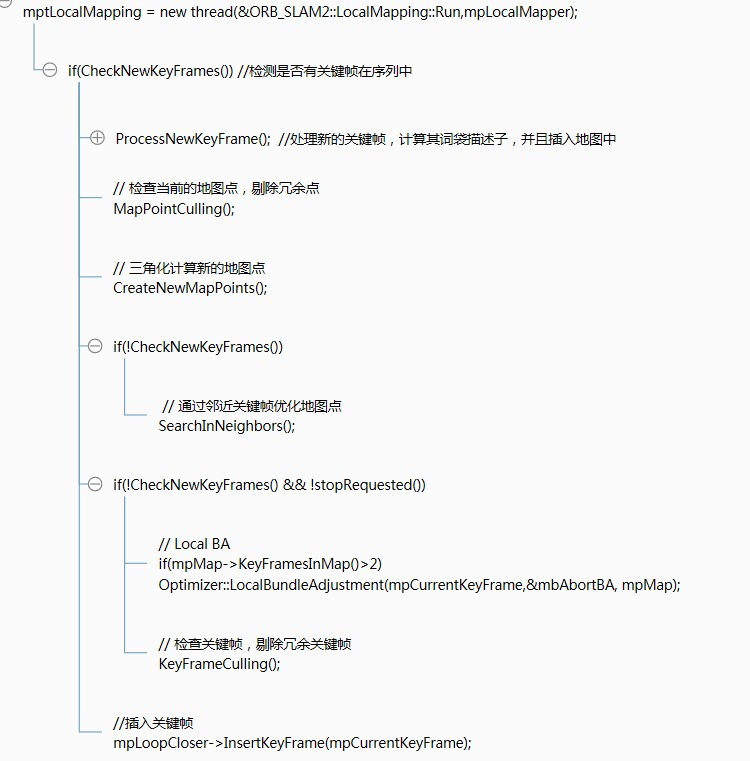
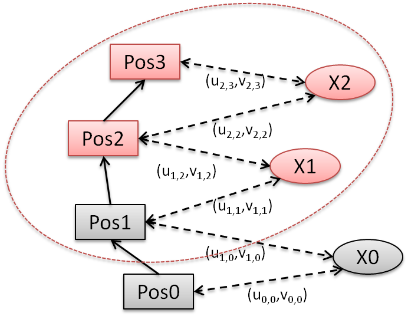
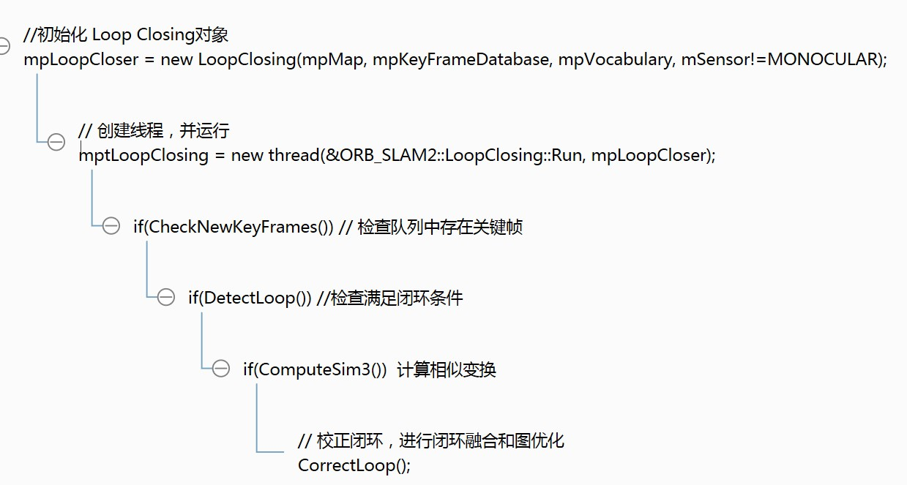
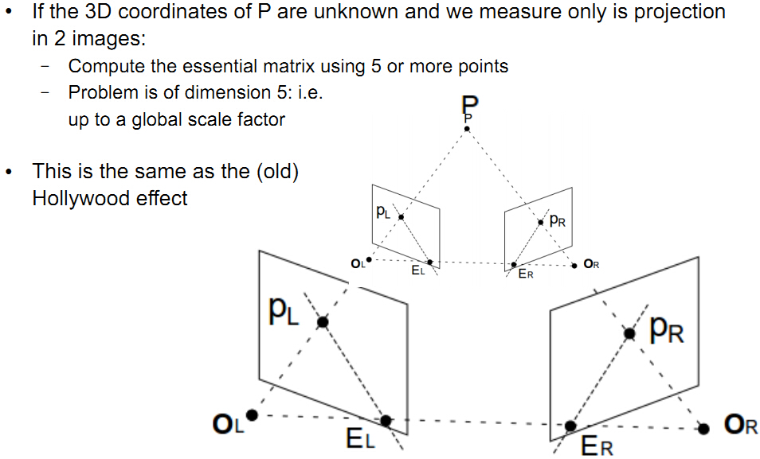

# ORBSLAM2_NOTE

## 综述
ORB-SLAM是一个基于特征点的实时单目SLAM系统，在大规模的、小规模的、室内室外的环境都可以运行。该系统对剧烈运动也很鲁棒，支持宽基线的闭环检测和重定位，包括全自动初始化。该系统包含了所有SLAM系统共有的模块：跟踪（Tracking）、建图（Mapping）、重定位（Relocalization）、闭环检测（Loop closing）。由于ORB-SLAM系统是基于特征点的SLAM系统，故其能够实时计算出相机的轨线，并生成场景的稀疏三维重建结果。ORB-SLAM2在ORB-SLAM的基础上，还支持标定后的双目相机和RGB-D相机。
ORB-SLAM其中的关键点如下图所示：

可以看到ORB-SLAM主要分为三个线程进行，也就是论文中的下图所示的，分别是Tracking、LocalMapping和LoopClosing。ORB-SLAM2的工程非常清晰漂亮，三个线程分别存放在对应的三个文件中，分别是Tracking.cpp、LocalMapping.cpp和LoopClosing.cpp文件中

（1）跟踪（Tracking） 
  这一部分主要工作是从图像中提取ORB特征，根据上一帧进行姿态估计，或者进行通过全局重定位初始化位姿，然后跟踪已经重建的局部地图，优化位姿，再根据一些规则确定新的关键帧。

（2）建图（LocalMapping） 
  这一部分主要完成局部地图构建。包括对关键帧的插入，验证最近生成的地图点并进行筛选，然后生成新的地图点，使用局部捆集调整（Local BA），最后再对插入的关键帧进行筛选，去除多余的关键帧。

（3）闭环检测（LoopClosing） 
  这一部分主要分为两个过程，分别是闭环探测和闭环校正。闭环检测先使用WOB进行探测，然后通过Sim3算法计算相似变换。闭环校正，主要是闭环融合和Essential Graph的图优化。

## 代码逻辑
一、整体框架
ORB_SLAM的代码非常整齐，简洁，便于阅读。由于我将使用其做室外场景的单目SLAM，所以我们从mono_kitti.cc这个主程序来看整个代码。为了更加方便阅读，我将其中的关键步骤做成思维导图，这样就可以一目了然了。喜欢的朋友请点赞！~ 
  如下图所示，程序在接收参数传递的参数后，就能够找到存放数据和参数的目录，开始运行。

（1）首先使用LoadImages读取图片目录和时间戳文件 
（2）创建ORB_SLAM2::System对象 
（3）循环读取数据 
 （3.1）读取图片 
 （3.2）读取时间戳 
 （3.3）将图片传给SLAM系统 
（4）关闭SLAM系统 
（5）将相机轨线保存到硬盘中
二、SLAM系统的创建
  在主函数中，我们创建了一个ORB_SLAM2::System的对象SLAM，这个时候就会进入到SLAM系统的主接口System.cc。这个代码是所有调用SLAM系统的主入口，在这里，我们将看到前面博客所说的ORB_SLAM的三大模块：Tracking、Mapping和LoopClosing。如下图所示：

我们可以看到在这个对象的实例化过程中，我们创建了以下对象： 
（1）创建了ORB词袋的对象 
（2）创建了关键帧的数据库 
（3）创建地图对象 
（4）创建两个显示窗口 
（5）初始化Tracking对象 
（6）初始化Local Mapping对象，并开启线程运行 
（7）初始化Loop Closing对象，并开启线程运行 
（8）初始化窗口，开启线程显示图像和地图点

  在这个实例化的过程中，我们开启了三个线程，分别是Local Mapping、Loop Closing和窗口显示的线程，那第一步Tracking在哪里运行呢？
三、Tracking的运行
  上面我们提到Tracking的运行入口，回顾第一部分，我们在循环读取图片的时候，调用了一个SLAM.TrackMonocular()函数，这个函数就是在主线程里调用Tracking的函数入口了。所以Tracking是运行在主线程中，并且在每次读取一帧新的图像时运行一次。如下图所示： 

可以看到，跟了两步之后，就能很清晰地看到，程序将读取的图片转成灰度图，然后对帧进行特征点检测，就直接调用Tracking.cc中的Track()函数，进行跟踪。另外要注意的是，由于使用的是单目相机，所以在跟踪时需要判断是否初始化或有没有前序关键帧，如果没有，使用mpIniORBextractor的参数进行特征点检测。

### 自动地图初始化
系统的第一步是初始化，ORB_SLAM使用的是一种自动初始化方法。这里同时计算两个模型：用于平面场景的单应性矩阵H和用于非平面场景的基础矩阵F，然后通过一个评分规则来选择合适的模型，恢复相机的旋转矩阵R和平移向量t。

一、找到初始对应点

  在当前帧FcFc中提取ORB特征点，与参考帧Fr进行匹配。如果匹配点对数过少，就重置参考帧。这一步骤在Tracking.cc中的Tracking::MonocularInitialization函数中。

    int nmatches = matcher.SearchForInitialization(mInitialFrame,mCurrentFrame,mvbPrevMatched,mvIniMatches,100);

nmatches表示匹配到的对应点对数。

二、同时计算两个模型

  在找到对应点之后，开始调用Initializer.cc中的Initializer::Initialized函数进行初始化工作。为了计算R和t，ORB_SLAM为了针对平面和非平面场景选择最合适的模型，同时开启了两个线程，分别计算单应性矩阵HcrHcr和基础矩阵FcrFcr。如下所示：

    thread threadH(&Initializer::FindHomography,this,ref(vbMatchesInliersH), ref(SH), ref(H));
    thread threadF(&Initializer::FindFundamental,this,ref(vbMatchesInliersF), ref(SF), ref(F));

这里的H和F分别满足下列关系：

---
$x_c = H_{cr} x_r   \\
x_c^T F_{cr} x_r  = 0$

线程threadH调用Initializer::FindHomography函数，计算单应性矩阵H，采用归一化的直接线性变换（normalized DLT）。线程threadF调用Initializer::FindFundamental函数计算基础矩阵F，使用归一化8点法。为了评估哪个模型更合适，文中使用SHSH和SFSF来计算各自的分值。分别调用Initializer::CheckHomography函数和Initializer::CheckFundamental函数进行计算，计算的方法如下所示，其中SMSM统一表示SHSH和SFSF： 

---
S_M = \sum_i(\rho_M(d^2_{cr}(x^i_c , x^i_r,M) + \rho_M(d^2_{rc}(x^i_c , x^i_r,M))  \\
\rho_M(d^2) = 
\begin{cases}
\tau-d^2\ \ if\ \ d^2<T_M \\
0\ \ if\ \ d^2 \geq T_M
\end{cases}

其中，d2cr和d2rc表示对称的转换误差，分别是从当前帧到参考帧的变换误差和参考帧到当前帧的变换误差。这里： 

---
T_H = 5.99, \ \ \ 
T_F = 3.84 \\
\tau = T_H

三、模型选择

  文中认为，当场景是一个平面、或近似为一个平面、或者视差较小的时候，可以使用单应性矩阵H，而使用基础矩阵F恢复运动，需要场景是一个非平面、视差大的场景。这个时候，文中使用下面所示的一个机制，来估计两个模型的优劣：

---
R_H = \frac{S_H}{S_H+S_F}

当RH大于0.45时，选择从单应性变换矩阵还原运动。不过ORB_SLAM2源代码中使用的是0.4作为阈值，如下：

    // Compute ratio of scores
        float RH = SH/(SH+SF);

        // Try to reconstruct from homography or fundamental depending on the ratio (0.40-0.45)
        if(RH>0.40)
            return ReconstructH(vbMatchesInliersH,H,mK,R21,t21,vP3D,vbTriangulated,1.0,50);
        else //if(pF_HF>0.6)
            return ReconstructF(vbMatchesInliersF,F,mK,R21,t21,vP3D,vbTriangulated,1.0,50);

四、运动恢复（sfm）
  选择好模型后，就可以恢复运动。 
（1）从单应性变换矩阵H中恢复 
  在求得单应性变化H后，本文使用FAUGERAS的论文[1]的方法，提取8种运动假设。这个方法通过可视化约束来测试选择合理的解。但是如果在低视差的情况下，点云会跑到相机的前面或后面，测试就会出现错误从而选择一个错误的解。文中使用的是直接三角化8种方案，检查两个相机前面具有较少的重投影误差情况下，在视图低视差情况下是否大部分云点都可以看到。如果没有一个解很合适，就不执行初始化，重新从第一步开始。这种方法在低视差和两个交叉的视图情况下，初始化程序更具鲁棒性。程序中调用Initializer::ReconstructH函数恢复运动。

(2)从基础矩阵F中恢复 
  在得到基础矩阵F，并且一直摄像机内参K的情况下，可以计算得到本质矩阵E，然后使用[2]中的方法，恢复出4个运动假设的解。这一部分的理论推导在之前博客做过介绍。其中基础矩阵F得到本质矩阵E的公式如下所示：

---
E_{rc} = K^TF_{rc}K

同样的，这4个解中只有一个是合理的，可以使用可视化约束来选择，本文使用与单应性矩阵做sfm一样的方法，即将4种解都进行三角化，然后从中选择出最合适的解。这里使用的是Initializer::ReconstructF函数。

五、集束调整
  最后使用一个全局集束调整（BA)，优化初始化结果。这一部分是在Tracking.cc中的CreateInitialMapMonocular()函数中，使用了如下语句：

    Optimizer::GlobalBundleAdjustemnt(mpMap,20);

  如下图所示，PTAM和LSD_SLAM在这个数据集中，会将所有点初始化在一个平面上，而ORB_SLAM会一直等到有足够的视差，才使用基础矩阵，得到最正确的初始化。由于ORB-SLAM对初始化的要求较高，因此初始化时可以选择一个特征丰富的场景，移动摄像机给它提供足够的视差。另外，由于坐标系会附着在初始化成功的那帧图像的位置，因此每次初始化不能保证在同一个位置。

### 跟踪
这一部分是ORB_SLAM系统中最基本的一步，会对每一帧图像进行跟踪计算。Tracking线程运行在主线程中，主要思路是在当前帧和（局部）地图之间寻找尽可能多的对应关系，来优化当前帧的位姿。每次新采集到一帧图像，就是用下列接口将图像传入SLAM系统就行处理。该代码位于主程序中：

    // Pass the image to the SLAM system
    SLAM.TrackMonocular(im,tframe);

在检查完系统将模式切换为跟踪模式后，是用下面接口进入功能：

    mpTracker->GrabImageMonocular(im,timestamp);

一、ORB提取
  本文做匹配的过程中，是用的都是ORB特征描述子。先在8层图像金字塔中，提取FAST特征点。提取特征点的个数根据图像分辨率不同而不同，高分辨率的图像提取更多的角点。然后对检测到的特征点用ORB来描述，用于之后的匹配和识别。跟踪这部分主要用了几种模型：运动模型（Tracking with motion model）、关键帧（Tracking with reference keyframe）和重定位（Relocalization）。

二、从前一帧初始化位姿估计
  在成功与前面帧跟踪上之后，为了提高速率，本文使用与之前速率相同的运动模式来预测相机姿态，并搜索上一帧观测到的地图点。这个模型是假设物体处于匀速运动，例如匀速运动的汽车、机器人、行人等，就可以用上一帧的位姿和速度来估计当前帧的位姿。使用的函数为TrackWithMotionModel()。这里匹配是通过投影来与上一帧看到的地图点匹配，使用的是matcher.SearchByProjection()。

    if(mVelocity.empty() || mCurrentFrame.mnId<mnLastRelocFrameId+2)
    {
        bOK = TrackReferenceKeyFrame();
    }
    else
    {
        bOK = TrackWithMotionModel();
        if(!bOK)
            bOK = TrackReferenceKeyFrame();
    }

当使用运动模式匹配到的特征点数较少时，就会选用关键帧模式。即尝试和最近一个关键帧去做匹配。为了快速匹配，本文利用了bag of words（BoW）来加速。首先，计算当前帧的BoW，并设定初始位姿为上一帧的位姿；其次，根据位姿和BoW词典来寻找特征匹配，使用函数matcher.SearchByBoW()；最后，利用匹配的特征优化位姿。

三、通过全局重定位来初始化位姿估计
  假如使用上面的方法，当前帧与最近邻关键帧的匹配也失败了，那么意味着需要重新定位才能继续跟踪。重定位的入口如下：

    bOK = Relocalization();

此时，只有去和所有关键帧匹配，看能否找到合适的位置。首先，计算当前帧的BOW向量，在关键帧词典数据库中选取若干关键帧作为候选。使用函数如下：

    // Relocalization is performed when tracking is lost
    // Track Lost: Query KeyFrame Database for keyframe candidates for relocalisation
    vector<KeyFrame*> vpCandidateKFs = mpKeyFrameDB->DetectRelocalizationCandidates(&mCurrentFrame);

其次，寻找有足够多的特征点匹配的关键帧；最后，利用RANSAC迭代，然后使用PnP算法求解位姿。这一部分也在Tracking::Relocalization() 里。

四、局部地图跟踪
  通过之前的计算，已经得到一个对位姿的初始估计，我们就能透过投影，从已经生成的地图点中找到更多的对应关系，来精确结果。函数入口为：

    bOK = TrackLocalMap();

为了降低复杂度，这里只是在局部图中做投影。局部地图中与当前帧有相同点的关键帧序列成为K1，在covisibility graph中与K1相邻的称为K2。局部地图有一个参考关键帧Kref∈K1，它与当前帧具有最多共同看到的地图云点。针对K1, K2可见的每个地图云点，通过如下步骤，在当前帧中进行搜索: 
（1）将地图点投影到当前帧上，如果超出图像范围，就将其舍弃； 
（2）计算当前视线方向向量v与地图点云平均视线方向向量n的夹角，舍弃n·v < cos(60°)的点云； 
（3）计算地图点到相机中心的距离d，认为[dmin, dmax]是尺度不变的区域，若d不在这个区域，就将其舍弃； 
（4）计算图像的尺度因子，为d/dmin； 
（5）将地图点的特征描述子D与还未匹配上的ORB特征进行比较，根据前面的尺度因子，找到最佳匹配。 
  这样，相机位姿就能通过匹配所有地图点，最终被优化。

五、关键帧的判断标准
  最后一步是确定是否将当前帧定为关键帧，由于在Local Mapping中，会剔除冗余关键帧，所以我们要尽快插入新的关键帧，这样才能更鲁棒。这个部分代码为：

    // Check if we need to insert a new keyframe
    if(NeedNewKeyFrame())
        CreateNewKeyFrame();

确定关键帧的标准如下： 
（1）在上一个全局重定位后，又过了20帧； 
（2）局部建图闲置，或在上一个关键帧插入后，又过了20帧； 
（3)当前帧跟踪到大于50个点； 
（4）当前帧跟踪到的比参考关键帧少90%。

六、代码架构

### 局部建图
在之前的Tracking中，我们得到了新的关键帧Ki。如下图所示，Local Mapping这部分 包括插入关键帧，剔除冗余的地图点和关键帧，还有进行局部集束调整。接下来按照顺序介绍各部分。 

这一部分通过之前实例化SLAM系统对象时，实例化了一个LocalMapping的对象，并且开启一个线程，运行LocalMapping::Run()函数。整个代码逻辑如下： 

一、关键帧插入
  首先将新的关键帧Ki作为新的节点Ki加入Covibility Graph，并且更新与那些能够共享地图点的关键帧节点相连接的边。同时更新关键帧Ki的生长树，并计算表示关键帧的词袋BOW。这一部分的接口是在LocalMapping.cc中的

     // BoW conversion and insertion in Map
     ProcessNewKeyFrame();
计算词袋，整合地图点到新的关键帧，计算法线和描述子的接口如下：

    // Compute Bags of Words structures
        mpCurrentKeyFrame->ComputeBoW();

    // Associate MapPoints to the new keyframe and update normal and descriptor
        const vector<MapPoint*> vpMapPointMatches = mpCurrentKeyFrame->GetMapPointMatches();

更新Covisibility Graph，将关键帧插入Map中的接口如下：

    // Update links in the Covisibility Graph
        mpCurrentKeyFrame->UpdateConnections();

    // Insert Keyframe in Map
        mpMap->AddKeyFrame(mpCurrentKeyFrame);

二、当前地图点剔除
  为了保存地图点，必须在创建该点云的前三帧测试通过约束，才能真正被保存，这样才能保证可跟踪且不容易在三角化时出现较大误差。这部分的接口如下：

    // Check recent MapPoints
        MapPointCulling();

一个点要被加入Map，需要满足下面条件： 
（1）这个点要在可预测到能够观察到该点的关键帧中，有超过25%的关键帧能够跟踪到这个点； 
（2）如果一个地图点被构建，它必须被超过三个关键帧观察到（在代码中，可以发现如果是单摄像头，这个阈值被设置为2）。

  一旦地图点被创建了，就只有在少于3个关键帧能够观察到该点时才会被剔除。而要剔除关键帧，通常是在局部集束调整剔除外点或者在后面剔除关键帧时才会发生。这样就保证了地图点很少存在外点影响效果。

三、新的地图点创建
  通过将检测到的ORB特征点，找到Covisibility Graph中与之相连的关键帧Kc，进行特征匹配，然后将匹配到的特征点进行三角化。对于没有匹配上的点，本文又与其他关键帧中未被匹配的特征点进行匹配。匹配方法使用的是之前的方法，并且将不满足对极几何约束的匹配点舍弃。ORB特征点对三角化后，检查正向景深、视差、反投影误差和尺度一致性，这时才得到地图点。一个地图点是通过两个关键帧观察到的，而它也可以投影到与之相连的其他关键帧中，这个时候可以使用Tracking部分的跟踪局部地图来在附近的关键帧中找到匹配。得到更多的地图点。这部分接口为：

    // Triangulate new MapPoints
        CreateNewMapPoints();

        if(!CheckNewKeyFrames())
        {
    // Find more matches in neighbor keyframes and fuse point duplications
            SearchInNeighbors();
        }

四、局部集束调整

  局部集束调整（local BA）会将当前处理的关键帧Ki进行优化，优化时如下图所示：现在优化Pos3位置的关键帧。同时参与优化的还有： 
所有在Covibility Graph中与该关键帧相连的关键帧Kc，即下图中的Pos2； 
所以被这些关键帧观察到的地图点，即X1和X2。 
另外还有能观察到地图点的但并未与当前处理的关键帧相连的关键帧，即下图中的Pos1。 
  但要注意的是，诸如Pos1的关键帧，参与优化中的约束，但不作为变量去改变它们的值。优化时得到的外点会在优化的中期或后期被剔除。 

这部分的接口如下：

    // Local BA
    if(mpMap->KeyFramesInMap()>2)
        Optimizer::LocalBundleAdjustment(mpCurrentKeyFrame,&mbAbortBA, mpMap);

五、局部关键帧剔除
  为了控制重建的紧凑度，LocalMapping会去检测冗余的关键帧，然后删除它们。这样的话会有利于控制，随着关键帧数目增长后，集束调整的复杂度。因为除非视角改变了，否则关键帧的数量在相同的环境中不应该无休止地增长。本文将那些有90%的点能够被超过三个关键帧观察到的关键帧认为是冗余关键帧，并将其删除。这个部分的接口如下：

    // Check redundant local Keyframes
    KeyFrameCulling();

最后，在所有步骤结束后，会将关键帧记录到数据库列表中。完成LocalMapping工作，将标志设为SetAcceptKeyFrames(true)，以允许Tracking线程继续得到关键帧。

### 闭环检测
毋庸置疑的是，随着相机的运动，我们计算的相机位姿，三角化得到的点云位置，都是有误差的，即使我们使用局部的或全局的BA去优化，仍然会存在累积误差。而消除误差最有效的办法是发现闭环，并根据闭环对所有结果进行优化。闭环是一个比BA更加强烈、更加准确的约束，所有如果能够检测到闭环，并对其优化，就可以让结果更加准确。 
  整个LoopClosing模块是在线程中完成，并在创建线程时调用LoopClosing::Run()函数让其运行。整个框架如下图所示： 

一、闭环条件检测
  首先我们计算关键帧Ki和在Covisibility Graph中与其相连的关键帧之间的词袋(BOW)之间的相似度。本文中，作者离线训练了大量的基于ORB描述的词袋，在程序运行时加载进去。这里的词袋作为对该关键帧的描述，将闭环检测转变为一个类似于模式识别的问题。当相机再次来到之前到过的场景时，就会因为看到相同的景物，而得到类似的词袋描述，从而检测到闭环。这里的接口是

    // Detect loop candidates and check covisibility consistency
    if(DetectLoop())

跟进函数接口，可以很清晰地看到检测闭环的过程，这里作者使用了DBOW2库。

二、计算Sim3
  单目SLAM系统存在一个问题，就是尺度的模糊性。如下图所示：

这个很好理解，因为针对一个三维点P点来说，我们在单目拍摄的两幅图中可以匹配到pL和pR，但是无法确定其在三角化里的具体位置，所以存在尺度模糊。而对于立体相机或RGBD相机，这里的尺度就可以唯一确定。所以，单目SLAM是一个Sim3相似变换群，有7个自由度，即1个尺度因子s、3个旋转角度、3个位移，即[sR|t]。显然，立体相机和RGBD相机中s=1。所以单目相机在优化时，是在相似变换群优化，本文是在RANSAC框架下进行优化。这个接口为：

    // Compute similarity transformation [sR|t]
    // In the stereo/RGBD case s=1
    if(ComputeSim3())

三、闭环融合
  闭环矫正的第一步是融合重复的点云，并且在Covisibility Graph中插入新的边以连接闭环。首先当前帧的位姿会根据相似变换而被矫正，同时所有与其相连的关键帧也会被矫正。所有的被闭环处的关键帧观察到的地图点会通过映射在一个小范围里，然后去搜索它的近邻匹配。这样就可以对所有匹配的点云进行更加有效的数据融合，并更新关键帧位姿，以及在图中的边。这部分接口为：

    // Perform loop fusion and pose graph optimization
   CorrectLoop();

四、Essential Graph优化
  为了有效地完成闭环，本文使用本质图（Essential Graph）去优化位姿图。这样就可以将闭环的误差分散到整个图中。这部分主要是在CorrectLoop()中的后部分：

    // Optimize graph
    Optimizer::OptimizeEssentialGraph(mpMap, mpMatchedKF, mpCurrentKF, NonCorrectedSim3, CorrectedSim3, LoopConnections, mbFixScale);

    // Add loop edge
    mpMatchedKF->AddLoopEdge(mpCurrentKF);
    mpCurrentKF->AddLoopEdge(mpMatchedKF);

  至此，整个ORB_SLAM2系统介绍完了。